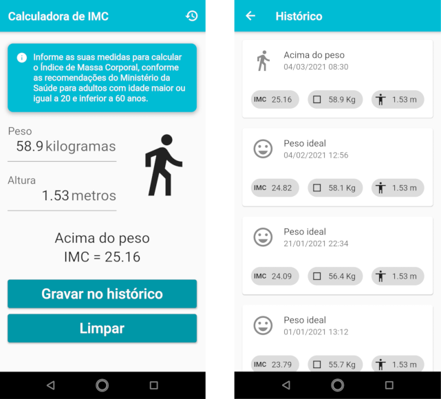

# imc

Aplicativo construído com o Flutter para a disciplina Desenvolvimento para Dispositivos Móveis.

Calcula o índice de massa corporal para adultos conforme as recomendações do Ministério da Saúde,
conforme o documento "Vigilância Alimentar e Nutricional - SISVAN: Orientações Básicas para a
coleta, o processamento, a análise de dados e a informação em serviços de saúde", ISBN 85-334-0824-2.

**Características:**

* Validação das entradas (aceita apenas valores numéricos, dentro dos limites)
* Ícone com transição animada para representar a classificação do IMC calculado
* Tema escuro utilizado quando o sistema está em modo noturno

  

Para executar o aplicativo, consulte a [documentação do Flutter](https://flutter.dev/docs).
